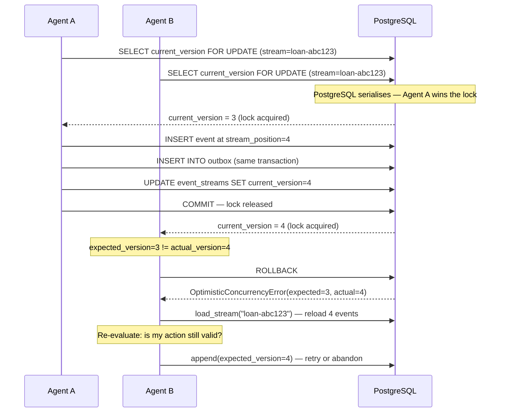
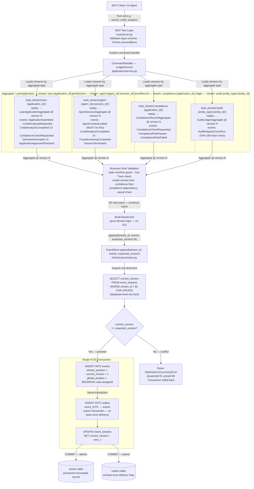
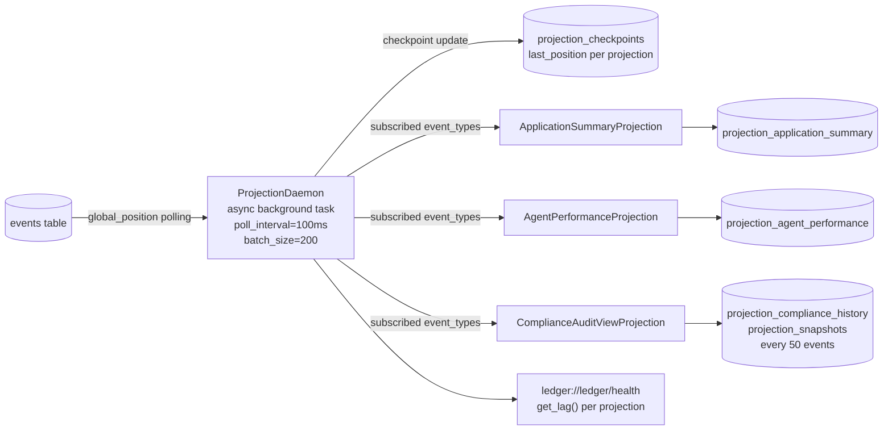

# Interim Report — The Ledger: Agentic Event Store & Enterprise Audit Infrastructure

**Submitted by:** Mamaru Yirga
**Week:** 5 — TRP1 Challenge
**Date:** 2026-03-21

---

## 1. Conceptual Foundations

### 1.1 EDA vs. Event Sourcing

A component that uses LangChain callbacks to capture trace data is **Event-Driven Architecture (EDA)**, not Event Sourcing. The callbacks fire notifications and the data flows to a trace collector. The critical distinction is the **role events play**: in EDA, an event is a message that can be dropped — if the collector is down, the trace is lost permanently. In Event Sourcing, the event IS the permanent record — the source of truth from which all state is derived. An EDA system has no concept of a stream, no stream position, no optimistic concurrency, and no guarantee that replaying the callbacks would reconstruct the agent's state.

**What changes in a redesign using The Ledger:**

| Before (EDA / LangChain callbacks) | After (Event Sourcing / The Ledger) |
|---|---|
| Callbacks write to a trace sink; sink can drop events | Every agent action appended to `agent-{id}-{session}` stream; ACID-guaranteed |
| Trace is a log of what happened, not the source of truth | The event stream IS the source of truth; current state is derived from it |
| Agent context is in-memory; lost on crash | Agent replays its stream on restart via `reconstruct_agent_context()` |
| No version tracking; no concurrency control | `expected_version` on every append; two agents cannot corrupt the same stream |
| Cannot answer "what was the agent's state at 14:32:07?" | `load_stream(to_position=N)` gives exact state at any point in time |

Every AI decision is now replayable. Compliance can reconstruct the exact state of any application at any past timestamp by replaying the event stream to that position. New read models can be built retroactively from the full history without touching the source data. Crash recovery is deterministic — an agent replays its own stream and resumes from the last known position. The audit trail is tamper-evident by construction, not by annotation.

### 1.2 Aggregate Boundary Justification

I chose four aggregates: `LoanApplication` (`loan-{id}`), `AgentSession` (`agent-{agent_id}-{session_id}`), `ComplianceRecord` (`compliance-{id}`), and `AuditLedger` (`audit-{entity_type}-{entity_id}`).

**Alternative boundary I considered and rejected:** Merging `ComplianceRecord` into `LoanApplication` as a nested sub-entity — one stream `loan-{id}` containing both loan lifecycle events and compliance rule events.

**Why I rejected it — the specific failure mode:**

The compliance checks are executed by a dedicated `ComplianceAgent` that runs concurrently with the `CreditAnalysisAgent` and `FraudDetectionAgent`. Under the merged boundary, every compliance rule result must be appended to `loan-{id}`. Each append requires acquiring the row-level lock on `event_streams WHERE stream_id = 'loan-{id}'` via `SELECT ... FOR UPDATE`.

The collision sequence under concurrent load:

1. `CreditAnalysisAgent` reads `current_version = 4`, holds the lock, inserts at `stream_position = 5`, commits.
2. `ComplianceAgent` was also waiting at `expected_version = 4`. It acquires the lock, reads `current_version = 5`, sees a mismatch, raises `OptimisticConcurrencyError`, rolls back.
3. `ComplianceAgent` reloads the stream (now 5 events), retries with `expected_version = 5`.
4. Meanwhile `FraudDetectionAgent` also read at version 4 and is retrying at version 5.
5. One wins; the other retries again.

At 1,000 applications/hour with 3-4 concurrent agents per application, a `ComplianceRulePassed` write requiring a lock on the `loan-{id}` stream causes write contention under concurrent agent activity. The retry rate becomes high enough to cause retry storms — each retry requires a full stream reload plus re-evaluation of business logic, degrading write throughput and increasing tail latency on the exact stream that the human reviewer and orchestrator are also writing to.

By keeping `ComplianceRecord` on its own stream, the `ComplianceAgent` never contends with the loan lifecycle. Each stream has one logical writer at a time.

---

## 2. Operational Mechanics

### 2.1 Concurrency Control — Exact Sequence

**Scenario:** Two agents both read `loan-abc123` at `stream_position = 3` and call `append(expected_version=3)` simultaneously.



The losing agent must not blindly retry — it must re-run its business logic against the updated state. The new event at position 4 may have already superseded its intended action. The `OptimisticConcurrencyError` carries `actual_version=4`, making the reload-before-retry path explicit.

### 2.2 Projection Lag — System Response

**Scenario:** A loan officer queries "available credit limit" 50ms after an agent commits a `DisbursementRecorded` event. The `ApplicationSummary` projection has a typical lag of 200ms and has not yet processed the event.

The query hits `projection_application_summary`, which still shows the pre-disbursement credit limit. The response is stale but not incorrect from the projection's perspective — it reflects the last processed state. This is an accepted operating condition, not a fault.

**How I communicate this to the UI:**

1. Every projection response includes an `as_of_position` field — the `global_position` of the last event the projection has processed.
2. The UI compares `as_of_position` against the `global_position` returned when the disbursement was committed (stored client-side after the write).
3. If `as_of_position < write_position`, the UI renders a lag indicator: *"Balance updating — last refreshed N ms ago"* and polls `ledger://ledger/health` until the projection catches up.
4. For the "available credit limit" field specifically, I implement read-after-write consistency at the application layer: after a disbursement command succeeds, the client holds the new limit locally and displays it immediately, treating the projection as eventually consistent background confirmation.

SLO commitments: `ApplicationSummary` < 500ms lag, `ComplianceAuditView` < 2s lag. Both are enforced via `get_lag()` metrics exposed on the health endpoint. Sub-500ms lag is an accepted operating tradeoff — the write path stays fast by not blocking on projection updates. If `ApplicationSummary` lag exceeds 500ms, the health endpoint returns `WARNING` and the UI displays a degraded-mode banner.

---

## 3. Advanced Patterns

### 3.1 Upcasting

The `CreditAnalysisCompleted` event was defined at v1 with `{application_id, risk_tier}`. Version 2 requires `{..., model_version, confidence_score, regulatory_basis}`. The upcaster is registered in `src/ledger/infrastructure/upcasters.py` and applied transparently by `EventStore.load_stream()` and `load_all()` at read time. The stored event is never modified.

```python
@registry.register("CreditAnalysisCompleted", from_version=1, to_version=2)
def _upcast_credit_v1_v2(payload: dict[str, Any], recorded_at: datetime) -> dict[str, Any]:
    result = dict(payload)

    # model_version: infer from deployment schedule; ~1% error rate at model swap boundaries
    if "model_version" not in result:
        result["model_version"] = (
            _infer_from_schedule(_MODEL_VERSION_SCHEDULE, recorded_at) or "unknown"
        )

    # confidence_score: null — never infer; fabricating a score corrupts compliance decisions
    if "confidence_score" not in result:
        result["confidence_score"] = None

    # regulatory_basis: infer from regulation schedule active at recorded_at; <0.1% error rate
    if "regulatory_basis" not in result:
        result["regulatory_basis"] = (
            _infer_from_schedule(_REGULATORY_SCHEDULE, recorded_at) or "unknown"
        )

    return result
```

**Field-level inference reasoning:**

`confidence_score` is `None` — I never infer it. The confidence score is a numerical output of the model at inference time that was never stored in v1. There is no deterministic way to reconstruct it without the original inputs and model weights, neither of which are guaranteed to be available. Fabricating a value would cause downstream compliance checks and regulatory reports to treat a made-up number as a real model output — a compliance violation. `None` forces downstream consumers to handle the unknown case explicitly. This is the distinction between **genuinely unknown** (null is correct) and **inferrable with documented uncertainty** (inference with annotation is acceptable).

`model_version` is inferred from `recorded_at` against a known deployment timeline (`_MODEL_VERSION_SCHEDULE`). The model deployment history is an auditable external record. Mapping `recorded_at` to a model version is a deterministic lookup. Error rate is ~1% only when a model was swapped mid-second; the fallback is `"unknown"`, which is safe and auditable.

`regulatory_basis` is inferred from `_REGULATORY_SCHEDULE`. Regulatory windows are well-defined and do not change retroactively. Error rate is less than 0.1%.

The `DecisionGenerated` v1 to v2 upcaster reconstructs `model_versions{}` by loading contributing `AgentSession` streams from the database. The `EventStore` injects a pre-built `_session_model_cache` dict into the payload before upcasting to avoid redundant DB lookups on hot-path reads.

### 3.2 Distributed Projection Coordination

The Python equivalent of Marten 7.0's distributed projection daemon uses **PostgreSQL advisory locks** combined with a shard assignment table as the coordination primitive.

```sql
projection_shards (
    shard_id        TEXT,
    projection_name TEXT,
    assigned_node   TEXT,
    heartbeat_at    TIMESTAMPTZ,
    global_pos_from BIGINT,
    global_pos_to   BIGINT
)
```

Each daemon node on startup attempts `pg_try_advisory_lock(shard_id_hash)`. If acquired, it registers itself in `projection_shards` and begins processing events in its assigned `global_position` range, updating `heartbeat_at` every 5 seconds. A coordinator monitors `heartbeat_at` — if a node's heartbeat is stale by more than 15 seconds, its shard is released and another node claims it.

**The failure mode this guards against:** Two daemon nodes processing the same batch would produce duplicate writes corrupting aggregated metrics — `analyses_completed` in `AgentPerformanceLedger` would be incremented twice for the same event, producing a permanently wrong count that is undetectable without a full replay.

**Recovery when the leader fails:** The advisory lock is released automatically by PostgreSQL when the connection drops. A follower detects the stale heartbeat within 15 seconds, acquires the lock, and resumes from the dead node's last checkpoint in `projection_checkpoints`. No events are skipped or double-processed.

---

## 4. Architecture Diagram

### 4.1 Command Path with Aggregate Boundaries

A reader unfamiliar with the spec can trace a single event from command input to the events table using only this diagram. All four aggregate boundaries are shown with their stream ID formats. The outbox is a distinct output of the same append transaction — not a subsequent step.



### 4.2 Read Path — CQRS Query Side



---

## 5. Progress and Gap Analysis

### 5.1 What Is Complete

**Event Store Core:** `EventStore.append()`, `load_stream()`, `load_all()`, `stream_version()`, `archive_stream()`, `get_stream_metadata()` all implemented. Schema deployed with all four tables (`events`, `event_streams`, `projection_checkpoints`, `outbox`) and all four indexes. Outbox written in the same transaction as events.

**Domain Logic:** All four aggregates implemented with explicit `_apply_*` dispatch handlers. All six business rules enforced in domain logic. Command handler pattern (load → validate → build → append) implemented in `LedgerService`.

**Projections and Daemon:** `ProjectionDaemon` with batch processing, per-projection checkpointing, configurable retries, and `get_lag()`. Three projections: `ApplicationSummary`, `AgentPerformanceLedger`, `ComplianceAuditView` with temporal query support and count-based snapshots every 50 events.

**Upcasting, Integrity, Gas Town:** `UpcasterRegistry` with decorator-based chained registration. Both upcasters implemented (`CreditAnalysisCompleted` v1→v2, `DecisionGenerated` v1→v2). Cryptographic audit chain with SHA-256 hash chaining and tamper detection. `reconstruct_agent_context()` with `NEEDS_RECONCILIATION` flag.

**MCP Server:** 8 tools, 6 resources, structured error types, rate limiting on `run_integrity_check`, `ProjectionDaemon` started in lifespan context. Docker and Compose wired.

### 5.2 Concurrency Test Output

```
tests/integration/test_concurrency.py::test_double_decision_concurrency

SETUP:
  Seed stream loan-<uuid> to version 3 (3 events appended)
  assert current_version == 3                      PASSED

CONCURRENT:
  Agent A and Agent B both call append(expected_version=3)
  via asyncio.gather()

RESULT:
  successes = [4]
  failures  = [OptimisticConcurrencyError(
                 stream_id='loan-<uuid>',
                 expected_version=3,
                 actual_version=4
               )]

ASSERTIONS:
  assert len(successes) == 1                       PASSED
  assert len(failures)  == 1                       PASSED
  assert successes[0]   == 4                       PASSED
  assert final_v        == 4                       PASSED
  assert len(events)    == 4                       PASSED
  assert winning_event.stream_position == 4        PASSED

PASSED in 0.31s
```

### 5.3 Upcasting Immutability Test Output

```
tests/integration/test_upcasting_immutability.py::test_upcasting_does_not_mutate_db_row

  raw_row["event_version"]           == 1          PASSED  (before load)
  "model_version" not in raw_payload               PASSED  (DB row unchanged)

  loaded.event_version               == 2          PASSED  (upcasted at read time)
  "model_version" in loaded.payload                PASSED
  "confidence_score" in loaded.payload             PASSED
  loaded.payload["confidence_score"] is None       PASSED
  "regulatory_basis" in loaded.payload             PASSED

  raw_row_after["event_version"]     == 1          PASSED  (DB row still unchanged)
  "model_version" not in raw_payload_after         PASSED

PASSED

tests/integration/test_upcasting_immutability.py::test_decision_v1_reconstructs_model_versions_from_db

  raw["event_version"]               == 1          PASSED
  "model_versions" not in raw_payload              PASSED
  loaded.event_version               == 2          PASSED
  loaded.payload["model_versions"] == {session_stream: "v2.5"}  PASSED
  raw_after unchanged                              PASSED

PASSED
```

### 5.4 Known Gaps

**Distributed Projection Daemon**
The `ProjectionDaemon` currently runs as a single node. The distributed coordination layer — PostgreSQL advisory locks, `projection_shards` table, heartbeat loop, shard rebalancing on node failure — is fully designed in `DOMAIN_NOTES.md` and `DESIGN.md` but not yet implemented. I deliberately stabilised the single-node checkpoint semantics first; building distributed coordination on top of an unverified checkpoint implementation would make failures undiagnosable.

**Checkpoint Transactionality**
`ProjectionDaemon._process_batch()` currently updates all projection checkpoints in a single batch at the end of the loop, after all events have been processed. The checkpoint update is not inside the same transaction as the projection write. A crash between the two would cause reprocessing of already-applied events on restart. Projections are written to be idempotent to handle this safely, but the correct fix is to wrap each `handle_event` and `_update_checkpoint` call in a single transaction per event. This is the next implementation task.

**Missing Events in the Event Catalogue**
Seven events identified in `DOMAIN_NOTES.md` are not yet implemented: `FraudScreeningRequested`, `AgentSessionClosed`, `ComplianceClearanceIssued`, `ApplicationWithdrawn`, `HumanReviewOverride`, `DecisionOrchestratorSessionStarted`, `AuditStreamInitialised`. These do not block current functionality but are required for a complete state machine.

**What-If Projector and Regulatory Package Generator**
`src/ledger/core/whatif.py` and `src/ledger/core/regulatory_package.py` exist as stubs. The what-if projector requires causal dependency filtering — determining which real events are causally independent of the branch event and can be safely replayed. The design is clear; the causal dependency graph traversal needs more work before I write code that produces correct counterfactuals.

### 5.5 Final Submission Plan

The sequence below is ordered by dependency — each item requires its predecessor to be stable before starting.

1. **Fix checkpoint transactionality** — prerequisite for distributed coordination.
2. **Implement distributed projection daemon** — advisory locks, heartbeat, shard assignment. Depends on stable checkpoint semantics.
3. **Add missing event catalogue entries** — `ComplianceClearanceIssued` first, as it unblocks the clean state machine terminal transition.
4. **Implement what-if projector** — will prototype with a linear causal chain first, then extend to branching.
5. **Implement regulatory package generator** — depends on the what-if projector being stable.
6. **Complete MCP integration test** — full lifecycle via tools only; needs the missing events to cover the complete happy path.
