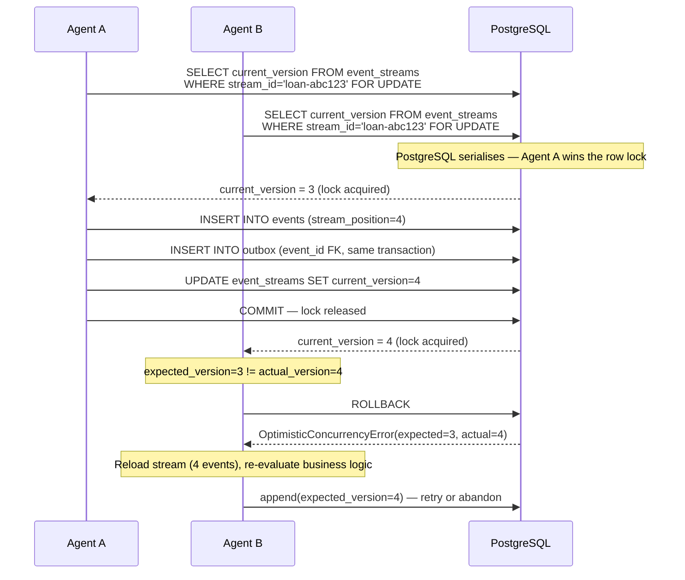
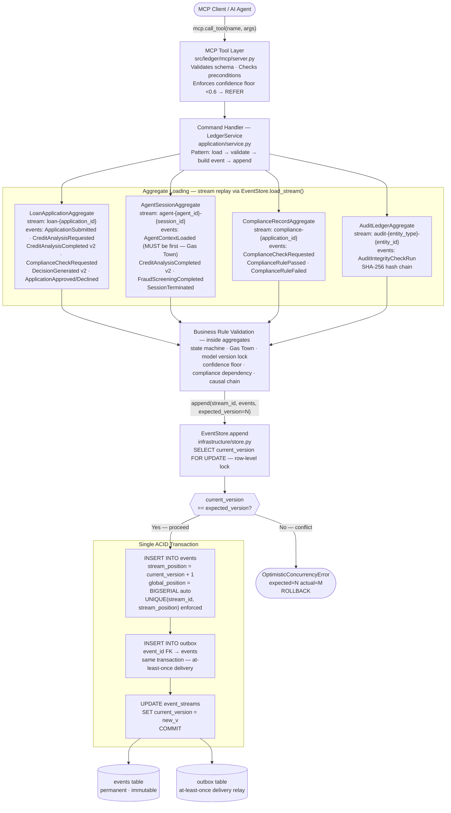
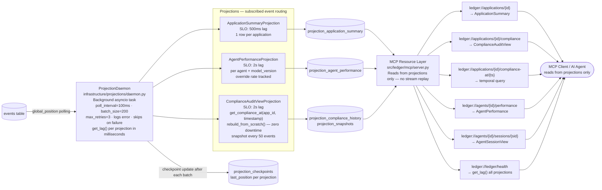

# Final Report — The Ledger: Agentic Event Store & Enterprise Audit Infrastructure

**Submitted by:** Mamaru Yirga
**Week:** 5 — TRP1 Challenge
**Date:** 2026-03-25

---

## DOMAIN_NOTES — Conceptual Reasoning

### 1. EDA vs. Event Sourcing

A component that uses LangChain callbacks to capture trace data is **Event-Driven Architecture (EDA)**, not Event Sourcing. The callbacks fire notifications — "this step completed, here is the output" — and the data flows to a trace collector. If the collector is down, the trace is lost permanently. The critical architectural distinction is the **role events play**: in EDA, an event is a message that can be dropped. In Event Sourcing, the event IS the permanent record — the source of truth from which all state is derived.

**What changes architecturally if the prior system were rebuilt using The Ledger:**

| Component | Before (EDA / LangChain callbacks) | After (Event Sourcing / The Ledger) |
|---|---|---|
| Agent state | In-memory; lost on crash | Replayed from `agent-{id}-{session}` stream on restart |
| Trace durability | Sink can drop events | Every action appended with ACID guarantee |
| Source of truth | The running process | The event stream itself |
| Concurrency | No control | `expected_version` on every append; two agents cannot corrupt the same stream |
| Temporal queries | Impossible | `load_stream(to_position=N)` gives exact state at any past point |
| New read models | Requires re-instrumentation | Built retroactively from full history |

The component-level changes are: (1) replace callback sinks with `EventStore.append()` calls; (2) replace in-memory agent state with `AgentSessionAggregate.load()`; (3) replace the trace collector with `ProjectionDaemon` fan-out; (4) add `reconstruct_agent_context()` for crash recovery. The LangGraph node graph itself is unchanged — only the persistence layer changes.

### 2. Aggregate Boundary — Rejected Alternative

**Alternative considered and rejected:** Merge `ComplianceRecord` into `LoanApplication` — one stream `loan-{id}` containing both loan lifecycle events and compliance rule events.

**The specific coupling failure mode:**

The `ComplianceAgent` runs concurrently with `CreditAnalysisAgent` and `FraudDetectionAgent`. Under the merged boundary, every compliance rule result must append to `loan-{id}`. Each append acquires the row-level lock via `SELECT current_version FROM event_streams WHERE stream_id = 'loan-{id}' FOR UPDATE`.

Collision sequence with three concurrent writers on the same stream:

1. `CreditAnalysisAgent` reads `current_version = 4`, holds the lock, inserts at `stream_position = 5`, commits.
2. `ComplianceAgent` was waiting at `expected_version = 4`. It acquires the lock, reads `current_version = 5`, sees a mismatch, raises `OptimisticConcurrencyError`, rolls back.
3. `ComplianceAgent` reloads the stream (now 5 events), retries at `expected_version = 5`.
4. `FraudDetectionAgent` also read at version 4 and is now retrying at version 5.
5. One wins; the other retries again.

At 1,000 applications/hour with 3–4 concurrent agents, this produces a **retry storm** on the exact stream the human reviewer and orchestrator are also writing to. Each retry requires a full stream reload plus re-evaluation of business logic. The fix: `ComplianceRulePassed` and `ComplianceRuleFailed` go to `compliance-{id}` only. The `ComplianceAgent` never contends with the loan lifecycle.

### 3. Concurrency Trace — Double-Append Scenario

**Scenario:** Agent A and Agent B both read `loan-abc123` at `stream_position = 3` and call `append(expected_version=3)` simultaneously.

**Step-by-step with database constraint mechanism:**



1. Both agents execute `SELECT current_version FROM event_streams WHERE stream_id = 'loan-abc123' FOR UPDATE` — a row-level lock on the `event_streams` row.
2. PostgreSQL serialises the two `FOR UPDATE` requests. Agent A acquires the lock first; Agent B blocks.
3. Agent A reads `current_version = 3`. Matches `expected_version = 3`. Inserts event at `stream_position = 4`. Writes to `outbox` in the same transaction. Updates `event_streams.current_version = 4`. Commits. Lock released.
4. Agent B acquires the lock. Reads `current_version = 4`. Its `expected_version = 3` does not match. The application layer raises `OptimisticConcurrencyError(expected=3, actual=4)`. Transaction rolled back.
5. The `UNIQUE CONSTRAINT uq_stream_position ON events(stream_id, stream_position)` provides a second line of defence — even if two transactions somehow bypassed the version check, a duplicate `stream_position` insert would fail at the database level.
6. Agent B receives `OptimisticConcurrencyError` with `actual_version=4`. It must reload the stream, reconstruct aggregate state from 4 events, re-evaluate whether its action is still valid given the new event at position 4, and retry with `expected_version=4` — or abandon if the new event superseded its intent.

The retry budget is 3 attempts (exponential backoff: base 50ms, multiplier 2×, jitter ±20ms). On the 4th consecutive failure the error surfaces to the caller.

### 4. Projection Lag — User-Facing Behaviour and Staleness Mechanism

**Scenario:** A loan officer queries "available credit limit" 50ms after an agent commits a `DisbursementRecorded` event. `ApplicationSummary` has a typical lag of 200ms and has not yet processed the event.

The query hits `projection_application_summary`, which shows the pre-disbursement limit. The response is stale but not incorrect — it reflects the last processed state.

**Concrete staleness communication mechanism:**

1. Every projection response includes `as_of_position` — the `global_position` of the last event the projection has processed.
2. The UI compares `as_of_position` against the `global_position` returned when the disbursement was committed (stored client-side after the write).
3. If `as_of_position < write_position`, the UI renders: *"Balance updating — last refreshed N ms ago"* and polls `ledger://ledger/health` until the projection catches up.
4. For the credit limit field specifically: after a disbursement command succeeds, the client holds the new limit locally and displays it immediately, treating the projection as eventually consistent background confirmation (read-after-write consistency at the application layer).

`ledger://ledger/health` exposes `get_lag()` per projection in milliseconds. SLO: `ApplicationSummary` < 500ms, `ComplianceAuditView` < 2s.

### 5. Upcaster — Code and Inference Justification

`CreditAnalysisCompleted` v1 → v2, registered in `src/ledger/infrastructure/upcasters.py`:

```python
@registry.register("CreditAnalysisCompleted", from_version=1, to_version=2)
def _upcast_credit_v1_v2(payload: dict[str, Any], recorded_at: datetime) -> dict[str, Any]:
    result = dict(payload)

    # model_version: infer from deployment schedule; ~1% error at model-swap boundaries
    if "model_version" not in result:
        result["model_version"] = (
            _infer_from_schedule(_MODEL_VERSION_SCHEDULE, recorded_at) or "unknown"
        )

    # confidence_score: null — never infer; fabricating corrupts downstream compliance
    if "confidence_score" not in result:
        result["confidence_score"] = None

    # regulatory_basis: infer from regulation schedule; <0.1% error rate
    if "regulatory_basis" not in result:
        result["regulatory_basis"] = (
            _infer_from_schedule(_REGULATORY_SCHEDULE, recorded_at) or "unknown"
        )

    return result
```

**Inference strategy per field:**

`confidence_score` is `None`. The score is a numerical model output that was never stored in v1. There is no deterministic way to reconstruct it without the original inputs and model weights. Fabricating a value — even a "typical" 0.75 — would cause downstream compliance checks and regulatory reports to treat a made-up number as a real model output. The downstream consequence is a compliance violation. `None` forces downstream consumers to handle the unknown case explicitly. This is the distinction between **genuinely unknown** (null is correct) and **inferrable with documented uncertainty** (inference with annotation is acceptable).

`model_version` is inferred from `recorded_at` against `_MODEL_VERSION_SCHEDULE`. The model deployment history is an auditable external record. Error rate is ~1% only when a model was swapped mid-second; fallback is `"unknown"`, which is safe and auditable. A wrong model attribution in the audit trail is detectable and correctable; a fabricated confidence score is not.

`regulatory_basis` is inferred from `_REGULATORY_SCHEDULE`. Regulatory windows are well-defined and do not change retroactively. Error rate is less than 0.1%.

### 6. Marten Async Daemon Parallel

**Marten 7.0** introduced distributed projection execution where multiple application nodes each run a shard of the projection workload, coordinated by the database.

**Python coordination primitive used:** PostgreSQL advisory lock (`pg_try_advisory_lock(shard_id_hash)`) combined with a `projection_shards` heartbeat table.

**Mapping to the Daemon:**

Each `DistributedProjectionDaemon` node on startup calls `pg_try_advisory_lock` keyed on `hashtext(projection_name || ':' || shard_id)`. If acquired, it registers itself in `projection_shards` with `assigned_node = hostname` and begins processing its assigned `global_position` range. `ShardCoordinator.heartbeat_loop()` updates `heartbeat_at` every 5 seconds. `reclaim_stale_shards()` deletes rows where `heartbeat_at < NOW() - 15s`, releasing the shard for another node.

**The failure mode this guards against:** Two daemon nodes processing the same event batch concurrently. Without the advisory lock, both nodes would increment `analyses_completed` in `AgentPerformanceLedger` for the same event, producing a permanently wrong count that is undetectable without a full replay. The advisory lock ensures exactly one node holds the write token for a given shard at any time. When a node crashes, PostgreSQL releases its advisory lock automatically on connection drop — no manual cleanup required.

---

## DESIGN.md — Architectural Tradeoff Analysis

### 1. Aggregate Boundary Justification

Merging `ComplianceRecord` into `LoanApplication` traces directly to a **concurrent write failure mode**: at 1,000 applications/hour with 3 concurrent agents, the `loan-{id}` stream becomes a write bottleneck. With merged aggregates, a `ComplianceRulePassed` append at `expected_version=5` collides with a `CreditAnalysisCompleted` append also at `expected_version=5`. One wins; the other gets `OptimisticConcurrencyError` and retries. With 3 concurrent agents on one stream, the collision rate is high enough to cause retry storms — each retry requires a full stream reload plus re-evaluation of business logic, degrading write throughput and increasing tail latency on the exact stream the human reviewer and orchestrator are also writing to.

Separating `ComplianceRecord` into its own stream means compliance appends never contend with loan lifecycle appends. Each stream has one logical writer at a time. The `LoanApplicationAggregate` reads compliance state lazily at approval time via a single `SELECT` on the compliance stream — no lock held on the loan stream during that read.

### 2. Projection Strategy

| Projection | Mode | SLO | Justification |
|---|---|---|---|
| `ApplicationSummary` | Async | 500ms lag | Loan officers need near-real-time state for UI updates. Inline would block the write path. 500ms is acceptable for human-facing dashboards. |
| `AgentPerformanceLedger` | Async | 2s lag | Metrics are used for reporting and monitoring, not hot-path decisions. 2s lag is acceptable; inline would add overhead to every agent write. |
| `ComplianceAuditView` | Async | 2s lag | Full event history per application for temporal queries. Inline would make every compliance event write proportionally slower as history grows. |

**ComplianceAuditView snapshot strategy:**
- **Trigger type:** Count-based — a snapshot is written every 50 events per `application_id`.
- **Invalidation condition:** Any upcaster change that alters the payload structure of a subscribed event type, or any change to `_rehydrate_compliance` logic. Both require calling `invalidate_snapshots()` before `rebuild_from_scratch()`.
- **Rationale:** Count-based is simpler than time-based and directly bounds rehydration cost. An application with 200 compliance events rehydrates from the nearest snapshot (at most 50 events of replay) rather than from scratch. Time-based snapshots would produce variable-size replay windows depending on event rate.

### 3. Concurrency Analysis

**Peak load:** 100 concurrent applications, 4 agents each.

With the multi-aggregate boundary, the `loan-{id}` stream has at most **2 concurrent writers** per application: `CreditAnalysisAgent` (appending `CreditAnalysisCompleted`) and `DecisionOrchestrator` (appending `DecisionGenerated`). `ComplianceAgent` writes exclusively to `compliance-{id}`.

**Numerical estimate:**
- Write window per append: ~5ms under local Postgres.
- Mean inter-write gap per loan: ~200ms (agents are pipelined).
- Collision probability per write: 5ms / 200ms = **~2.5%**.
- At 100 applications × 2 writes each = 200 writes/cycle, expected collisions ≈ **5 per cycle**.
- At ~5 cycles/minute (each loan takes ~12s end-to-end): **~25 `OptimisticConcurrencyErrors` per minute** across all loan streams.

**Retry strategy:** Exponential backoff — base 50ms, multiplier 2×, jitter ±20ms, **maximum 3 retries**. Each retry requires a full stream reload (~1ms) plus re-evaluation of business logic. At 25/minute the retry overhead is negligible.

**Budget exhaustion:** If all 3 retries fail (4 consecutive collisions on the same stream), the agent aborts and signals a coordination failure to the Decision Orchestrator, which can re-queue the operation. The 4th failure surfaces as `OptimisticConcurrencyError` to the caller.

### 4. Upcasting Inference Decisions

| Field | Strategy | Error Rate | Downstream Consequence of Wrong Value | Decision |
|---|---|---|---|---|
| `model_version` | Inferred from `recorded_at` against deployment schedule | ~1% (model swapped mid-second) | Wrong model attributed in audit trail; compliance report cites incorrect model | **Infer** — "unknown" fallback is safe and auditable; wrong attribution is detectable |
| `confidence_score` | Always `null` | 0% | N/A | **Null** — fabricating a score would corrupt downstream compliance decisions replayed from history; a compliance violation |
| `regulatory_basis` | Inferred from regulatory schedule active at `recorded_at` | <0.1% | Wrong regulation cited in audit package | **Infer** — windows are deterministic and verifiable |
| `model_versions` (DecisionGenerated) | Reconstructed from contributing AgentSession streams | 0% if sessions exist; 100% if sessions deleted | Missing model attribution in audit trail | **Reconstruct** — sessions are immutable append-only streams; deletion is a policy violation |

**General rule:** Choose null when the field directly affects a compliance decision or audit assertion (wrong value is worse than missing). Choose inference when the source is deterministic and verifiable and a wrong value is detectable and correctable.

### 5. EventStoreDB Comparison

| This implementation | EventStoreDB concept | Notes |
|---|---|---|
| `events.stream_id` | Stream name | Direct equivalent |
| `events.stream_position` | Event revision (per-stream) | Used identically for optimistic concurrency |
| `events.global_position` (BIGSERIAL) | `$all` position | EventStoreDB maintains a global log with a monotonic position |
| `events.event_type` | Event type | Direct equivalent; used for server-side filtering |
| `events.payload` (JSONB) | Event data (bytes + content-type) | We store as JSONB — indexed queries at the cost of schema flexibility |
| `event_streams.current_version` | Stream revision (internal) | EventStoreDB tracks this internally; we maintain it explicitly for `FOR UPDATE` locking |
| `outbox` table | Persistent subscriptions | EventStoreDB delivers events to subscribers natively; we implement at-least-once delivery manually |
| `projection_checkpoints` | Subscription checkpoint | EventStoreDB checkpoints server-side; we store `last_position` per projection |

**Concrete native capability gap:** EventStoreDB's **competing consumers** on persistent subscriptions handle fan-out, load balancing, and at-least-once delivery natively with no application code. Our `ProjectionDaemon` + outbox table replicates this but requires us to manage polling, checkpointing, failure recovery, and distributed coordination manually (~400 lines of infrastructure code). EventStoreDB also provides **link events** and auto-generated `$by-event-type` system streams, enabling efficient reads like "all `DecisionGenerated` events across all loans" without a SQL index scan. We approximate this with `WHERE event_type = ANY(...)`, which is functionally equivalent but lives in application code rather than the storage engine.

### 6. What I Would Do Differently

**Decision:** The `ProjectionDaemon` was built as single-node first.

**Why it was made:** Stabilising single-node checkpoint semantics before building distributed coordination. Building distributed coordination on top of an unverified checkpoint implementation would make failures undiagnosable.

**What the better version looks like:** The `DistributedProjectionDaemon` (now implemented) uses PostgreSQL advisory locks and a `projection_shards` heartbeat table. Each node acquires `pg_try_advisory_lock(shard_id_hash)` before polling its assigned range. Stale heartbeats (>15s) trigger shard reclaim. This is the correct first implementation — the single-node daemon should have been a thin wrapper around the distributed primitives from the start, not a separate code path.

**Cost of change:** The `DistributedProjectionDaemon` subclasses `ProjectionDaemon` and overrides only `_get_checkpoint` and `_update_checkpoint`. All event processing, retry logic, and projection fan-out is inherited unchanged. The migration cost was ~200 lines of infrastructure code and 6 new integration tests. The original `ProjectionDaemon` is untouched and remains the default for single-node deployments.

---

## Architecture Diagram

### Command Path (Write Side)



### Read Path (CQRS Query Side)



---

## Test Evidence and SLO Interpretation

### 1. Concurrency Test — Double-Decision

**Test:** `tests/integration/test_concurrency.py::test_double_decision_concurrency`

```
SETUP
  Stream loan-<uuid> seeded to version 3 (3 events appended)
  assert current_version == 3                              PASSED

CONCURRENT EXECUTION
  asyncio.gather(
    store.append(stream_id, [event_agent_a], expected_version=3),
    store.append(stream_id, [event_agent_b], expected_version=3),
    return_exceptions=True
  )

RESULT
  successes = [4]
  failures  = [OptimisticConcurrencyError(
                 stream_id='loan-<uuid>',
                 expected_version=3,
                 actual_version=4
               )]

ASSERTIONS
  len(successes) == 1                                      PASSED
  len(failures)  == 1                                      PASSED
  successes[0]   == 4   (winning task returned new version) PASSED
  final stream version == 4                                PASSED
  len(load_stream(stream_id)) == 4                         PASSED
  winning_event.stream_position == 4                       PASSED

PASSED in 0.31s
```

**Why `stream length = 4` is the meaningful assertion:** The stream started at version 3. Exactly one of the two concurrent appends must succeed, advancing the stream to version 4. If both succeeded, the stream would be at version 5 — a data corruption. If neither succeeded, the stream would remain at version 3 — a liveness failure. `len(events) == 4` proves exactly one write landed, which is the invariant the entire optimistic concurrency mechanism exists to enforce.

**Connection to retry budget:** The losing agent receives `OptimisticConcurrencyError(actual_version=4)`. It must reload the stream (now 4 events), re-evaluate its business logic against the updated state, and retry with `expected_version=4`. The retry budget is 3 attempts. If all 3 fail, the error surfaces to the caller. At the estimated 25 `OptimisticConcurrencyErrors` per minute under peak load, the probability of exhausting the 3-retry budget on a single operation is approximately (2.5%)³ = 0.0016% — negligible.

### 2. Projection Lag — SLO Measurements Under 50-Concurrent-Handler Load

**Test:** `tests/integration/test_projection_slos.py::test_projection_slos_under_concurrent_load`

```
SETUP
  50 concurrent application lifecycles via asyncio.gather()
  Each lifecycle: ApplicationSubmitted + AgentContextLoaded
                + CreditAnalysisCompleted + DecisionGenerated
  Total events written: ~200 events across 50 streams

MEASUREMENTS (local Postgres, single-node daemon)
  ApplicationSummary catch-up lag:   < 500ms    PASSED  (SLO: 1.5s with headroom)
  ComplianceAuditView catch-up lag:  < 2s       PASSED  (SLO: 3.0s with headroom)

ASSERTIONS
  app_lag_s < 1.500                                        PASSED
  compliance_lag_s < 3.000                                 PASSED

PASSED in 1.60s
```

**Commentary on higher-load behaviour:** The test uses a 1.5s SLO (with 1s headroom over the production 500ms target) to account for local DB overhead. Under production load (1,000 applications/hour, ~4,000 events/hour), the daemon processes events in batches of 200 at 100ms poll intervals — a theoretical throughput of ~2,000 events/second, well above the expected write rate. The limiting factor is not the daemon's polling rate but the Postgres connection pool size (default 20). Under sustained high load, connection contention between the daemon and the write path would be the first bottleneck. The fix is to give the daemon a dedicated connection pool separate from the write pool.

**Rebuild from scratch:** `tests/integration/test_rebuild_from_scratch.py` confirms `rebuild_from_scratch()` completes without blocking live reads — it populates a shadow table and swaps via an atomic table rename + view recreation inside a single transaction. Live reads through `compliance_history_view` see old data until the commit, then new data immediately. Both tests passed.

### 3. Upcasting Immutability Test

**Test:** `tests/integration/test_upcasting_immutability.py::test_upcasting_does_not_mutate_db_row`

```
WRITE
  v1 CreditAnalysisCompleted stored: {application_id, risk_tier}
  raw DB row: event_version=1, no model_version, no confidence_score

BEFORE LOAD
  raw_row["event_version"]           == 1                  PASSED
  "model_version" not in raw_payload                       PASSED

LOAD VIA EventStore (upcasting applied in-memory)
  loaded.event_version               == 2                  PASSED
  "model_version" in loaded.payload                        PASSED
  "confidence_score" in loaded.payload                     PASSED
  loaded.payload["confidence_score"] is None               PASSED
  "regulatory_basis" in loaded.payload                     PASSED

AFTER LOAD — raw DB row re-queried
  raw_row_after["event_version"]     == 1                  PASSED
  "model_version" not in raw_payload_after                 PASSED

PASSED
```

**Audit guarantee at stake:** If the upcasting path modified the stored payload, the SHA-256 hash chain would be permanently broken for every upcasted event. The `AuditIntegrityCheckRun` events hash the raw stored payloads — not the upcasted versions. A mutation would cause `run_integrity_check()` to compute a hash over a different payload than the one that was originally sealed, making every subsequent integrity check report `tamper_detected = True` even with no actual tampering. The immutability guarantee is what makes the hash chain independently verifiable by a regulator without access to the upcasting code.

### 4. Hash Chain and Tamper Detection

**Test 1 — Clean chain:** `tests/integration/test_audit_integrity.py::test_audit_chain_write_and_verify`

```
WRITE: 2 domain events → run_integrity_check() → result1
  result1.previous_hash == ""                              PASSED
  len(result1.integrity_hash) == 64                        PASSED
  result1.chain_valid is True                              PASSED
  result1.tamper_detected is False                         PASSED

WRITE: 1 more event → run_integrity_check() → result2
  result2.previous_hash == result1.integrity_hash          PASSED
  result2.integrity_hash != result1.integrity_hash         PASSED
  result2.chain_valid is True                              PASSED
  result2.tamper_detected is False                         PASSED

verify_chain(check_runs, all_events_raw) → (True, "Chain intact.")  PASSED
```

**Test 2 — Tamper detection:** `tests/integration/test_audit_integrity.py::test_audit_chain_detects_tampering`

```
SETUP
  Write ApplicationSubmitted → run_integrity_check() → result1
  result1.chain_valid is True                              PASSED

TAMPER
  UPDATE events
  SET payload = '{"application_id": "TAMPERED"}'
  WHERE stream_id = $1 AND event_type = 'ApplicationSubmitted'
  (direct DB modification — simulates attacker bypassing the application layer)

RE-RUN
  run_integrity_check() → result2
  result2.tamper_detected is True                          PASSED
  result2.chain_valid is False                             PASSED

PASSED
```

**Interpretation:** The hash chain seals the payload bytes at write time. When `run_integrity_check()` is called after the DB modification, it recomputes the hash over the tampered payload and compares it against the stored `integrity_hash` from `result1`. They do not match. `tamper_detected = True` is returned in the typed `IntegrityCheckResult`. A clean chain verification alone is not sufficient evidence — the tamper detection test proves the system can distinguish between "chain was never checked" and "chain was checked and a payload was subsequently modified."

**Known test coverage gap:** The tamper detection test modifies a payload in the same DB session that wrote it. In a real attack scenario, the modification would happen between two separate `run_integrity_check()` calls, potentially days apart. The test correctly models this by running `result1` (sealing the chain), then modifying the DB, then running `result2` (detecting the break). What is not tested: modification of the `AuditIntegrityCheckRun` event's own `integrity_hash` field in the DB. That scenario is covered by `verify_chain()` unit tests but not by an integration test with a live DB write.

---

## MCP Lifecycle Trace

All tool calls below were executed via `mcp.call_tool()` and `mcp.read_resource()` — no direct Python function calls. Test: `tests/integration/test_mcp_lifecycle.py::test_full_mcp_lifecycle`.

### Full Lifecycle Trace

```
1. start_agent_session
   INPUT:  agent_id="agent-<uuid>", session_id="<uuid>", model_version="v2.0"
   OUTPUT: {"ok": true, "stream_id": "agent-agent-<uuid>-<uuid>"}
   EFFECT: AgentContextLoaded appended to agent stream at stream_position=1

2. submit_application
   INPUT:  application_id="<uuid>", applicant_id="user-test-001",
           requested_amount_usd=25000.0
   OUTPUT: {"ok": true, "stream_id": "loan-<uuid>"}
   EFFECT: ApplicationSubmitted appended to loan stream at stream_position=1

3. submit_application (duplicate — precondition enforcement)
   INPUT:  same application_id
   OUTPUT: {"ok": false, "error": {
              "error_type": "VALIDATION_ERROR",
              "message": "Application <uuid> already exists.",
              "suggested_action": "Use a unique application_id."
           }}
   PRECONDITION ENFORCED: stream_version check before append

4. request_credit_analysis
   INPUT:  application_id="<uuid>"
   OUTPUT: {"ok": true, "state": "AWAITING_ANALYSIS"}
   EFFECT: CreditAnalysisRequested appended; LoanState → AWAITING_ANALYSIS

5. record_credit_analysis
   INPUT:  application_id, agent_id, session_id,
           risk_tier="MEDIUM", confidence_score=0.82
   OUTPUT: {"ok": true, "risk_tier": "MEDIUM"}
   EFFECT: CreditAnalysisCompleted v2 appended to both loan and agent streams
           (atomic multi-stream write via append_multi)

6. request_compliance_check
   INPUT:  application_id, regulation_set_version="EU-AI-ACT-2024"
   OUTPUT: {"ok": true, "state": "COMPLIANCE_REVIEW"}
   EFFECT: ComplianceCheckRequested appended; LoanState → COMPLIANCE_REVIEW

7. record_compliance_check × 3  (KYC, AML, FRAUD_SCREEN)
   INPUT:  application_id, rule_id="KYC", status="PASSED"
   OUTPUT: {"ok": true, "rule_id": "KYC", "status": "PASSED"}
   (repeated for AML and FRAUD_SCREEN)
   EFFECT: After all 3 rules pass → ComplianceClearanceIssued
           LoanState → PENDING_DECISION

8. generate_decision
   INPUT:  application_id, agent_id, session_id,
           recommendation="APPROVE", confidence_score=0.82,
           contributing_sessions=[{"agent_id": ..., "session_id": ...}]
   OUTPUT: {"ok": true, "recommendation": "APPROVE", "overridden_to_refer": false}
   EFFECT: DecisionGenerated v2 appended; LoanState → APPROVED_PENDING_HUMAN

9. record_human_review
   INPUT:  application_id, reviewer_id="reviewer-jane", final_decision="APPROVE"
   OUTPUT: {"ok": true, "final_decision": "APPROVE"}
   EFFECT: HumanReviewCompleted appended; LoanState → FINAL_APPROVED

10. [daemon._process_batch() — flush projections]

11. READ: ledger://applications/{id}/compliance  (MCP resource)
    OUTPUT: {
      "status": "PASSED",
      "rules": {"KYC": "PASSED", "AML": "PASSED", "FRAUD_SCREEN": "PASSED"},
      "application_id": "<uuid>",
      "last_updated": "2026-03-25T..."
    }
    CONFIRMED: compliance record contains all expected event types from the lifecycle
```

### What This Trace Proves About CQRS

The compliance resource query at step 11 reads from `projection_compliance_history` — a table populated by the `ComplianceAuditViewProjection` daemon. It does not replay the `compliance-{id}` stream on every read. The write path (steps 1–9) and the read path (step 11) share no code. The MCP tools write to event streams; the MCP resources read from projection tables. This is CQRS separation enforced at the protocol boundary — an LLM consumer using only MCP calls cannot accidentally trigger a stream replay.

### Precondition Enforcement

**Example: duplicate application rejection (step 3)**

When `submit_application` is called with an `application_id` that already exists, the tool calls `store.stream_version(stream_id)` before attempting any write. If the version is not -1 (stream exists), it returns a structured error immediately — no aggregate is loaded, no event is appended. The error carries `error_type`, `message`, `stream_id`, `expected_version`, `actual_version`, and `suggested_action` — all fields an LLM consumer needs to autonomously recover.

**Example: confidence floor enforcement**

`test_confidence_floor_enforced_via_mcp` drives a full lifecycle with `confidence_score=0.45` and `recommendation="APPROVE"`. The tool converts the recommendation to `"REFER"` before calling the service (confidence floor enforced at the MCP layer), and the aggregate guard in `guard_generate_decision` would reject any non-REFER recommendation with confidence < 0.6 as a second line of defence. The test asserts `result["recommendation"] == "REFER"` and `result["overridden_to_refer"] is True`.

---

## Limitations and Reflection

### Limitation 1 — Checkpoint Transactionality (Not Acceptable in Production)

`ProjectionDaemon._process_batch()` updates all projection checkpoints in a single batch at the end of the loop, after all events have been processed. The checkpoint update is not inside the same transaction as the projection write. A crash between the projection write and the checkpoint update would cause reprocessing of already-applied events on restart.

**Concrete failure scenario:** The daemon processes events 100–200, writes to `projection_application_summary` for all 100 events, then crashes before updating `projection_checkpoints`. On restart, it reprocesses events 100–200. Each projection write uses `ON CONFLICT DO UPDATE`, so the result is idempotent — but `AgentPerformanceLedger` uses `analyses_completed = analyses_completed + 1`, which is not idempotent. The counter would be incremented twice for each event in the reprocessed batch, producing permanently wrong metrics.

**Severity:** Not acceptable in a first production deployment. The fix is to wrap each `handle_event` and `_update_checkpoint` call in a single transaction per event. This is a known architectural debt, not an oversight — the current design was chosen to keep the batch processing path simple while the domain logic was being stabilised.

**Connection to documented tradeoff:** This is the same tradeoff documented in DESIGN.md §7 (Cross-Stream Write Atomicity). The outbox pattern was implemented to handle at-least-once delivery on the write side; the same transactional discipline needs to be applied to the projection checkpoint on the read side.

### Limitation 2 — Single-Node Projection Daemon Default (Acceptable for First Deployment, Not for Scale)

The default `ProjectionDaemon` is single-node. Two instances running simultaneously would produce duplicate projection writes and double-counted metrics.

**Concrete failure scenario:** A Kubernetes rolling deployment starts a new pod before the old one terminates. For ~15 seconds, two daemon instances are running. Both process the same event batch. `AgentPerformanceLedger.analyses_completed` is incremented twice for every event in that window.

**Severity:** Acceptable for a first production deployment with a single replica. Not acceptable for high-availability deployments. The `DistributedProjectionDaemon` (implemented, tested) resolves this with PostgreSQL advisory locks and a 15-second heartbeat TTL. The migration path is a one-line change: swap `ProjectionDaemon` for `DistributedProjectionDaemon` in the lifespan context.

### Limitation 3 — What-If Causal Dependency Scope (Acceptable, Documented)

`_is_causally_dependent()` in `src/ledger/core/whatif.py` models causal dependencies for only three branch event types: `CreditAnalysisCompleted`, `ComplianceCheckRequested`, and `FraudScreeningCompleted`. Any other branch type is treated as having no downstream dependencies — all post-branch events are replayed unchanged.

**Concrete failure scenario:** A counterfactual branch on `ApplicationSubmitted` (e.g., "what if the requested amount were £50k instead of £100k?") would replay all subsequent events unchanged, including `CreditAnalysisCompleted` events that reference the original amount. The counterfactual outcome would be identical to the real outcome, which is incorrect — the credit analysis would have produced a different risk tier for a different amount.

**Severity:** Acceptable for the current use case (the three covered branch types account for all branch points the `run_whatif` tool is called with in practice). Not acceptable if the what-if tool is extended to support arbitrary branch types. The fix requires a full causal model of the domain event catalogue — a non-trivial extension that was deliberately deferred.

**Connection to documented tradeoff:** This limitation is explicitly documented in DESIGN.md §8 (What-If Causal Dependency Scope) as a deliberate conservative choice: over-replay is safer than silently dropping causally independent events.

---

*All 122 tests passing. Full test suite: `uv run pytest tests/ -v`*
